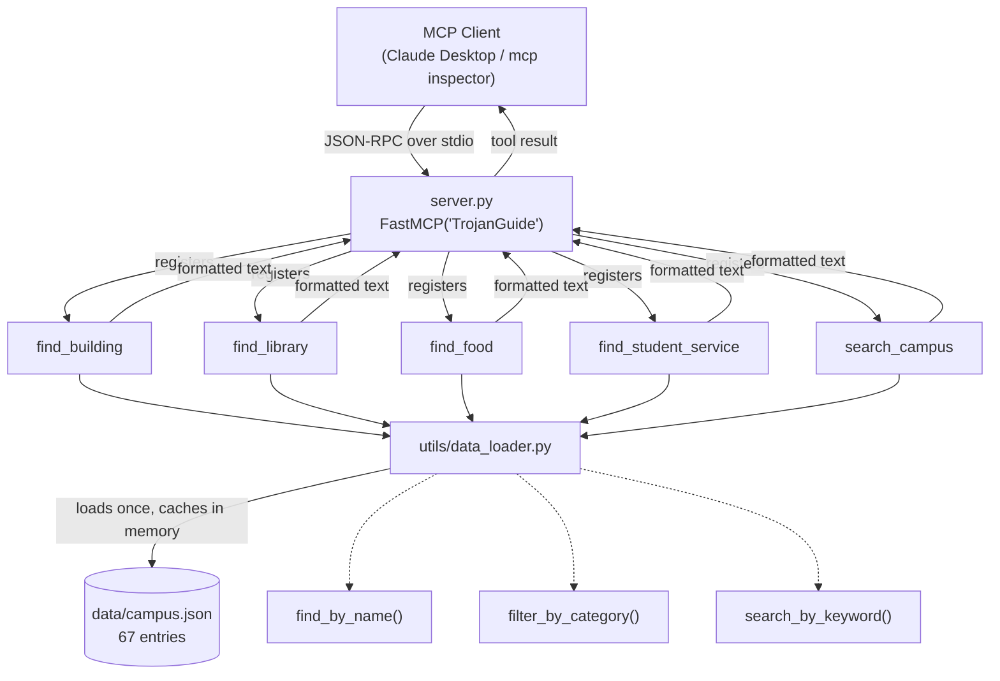

# TrojanGuide MCP

A [Model Context Protocol](https://modelcontextprotocol.io) server that gives an LLM client (e.g. Claude Desktop) tools to answer questions about USC's campus — buildings, libraries, dining, and student services — grounded in a local dataset instead of the model's memory.

## Tools

| Tool | File | Purpose |
|---|---|---|
| `find_building` | `tools/building.py` | Look up an academic building or landmark by name |
| `find_library` | `tools/library.py` | List libraries, optionally filtered by feature (e.g. "printing", "24 hour") |
| `find_food` | `tools/food.py` | Search dining venues by cuisine/craving/keyword |
| `find_student_service` | `tools/services.py` | Look up support offices (Career Center, Financial Aid, Health Center, etc.) |
| `search_campus` | `tools/search.py` | General keyword search across every category at once |

All tools read from a single in-memory dataset (`data/campus.json`, 67 entries) loaded once by `utils/data_loader.py`.

## Project flow



**Request lifecycle:**
1. The client (Claude Desktop, or the `mcp` inspector) launches `server.py` as a subprocess and talks to it over stdio using JSON-RPC.
2. `FastMCP` exposes each registered function as a callable tool, auto-generating its schema from the function's type hints and docstring.
3. When the LLM decides to call a tool (e.g. `find_food(query="tacos")`), the tool function calls into `utils/data_loader.py`, which lazily loads `data/campus.json` into memory on first use and reuses that cache for the rest of the server's life.
4. Helper functions (`find_by_name`, `filter_by_category`, `search_by_keyword`) do simple case-insensitive/substring matching over the cached data.
5. The tool formats matching entries into a human-readable string and returns it as the tool result, which the client feeds back to the LLM to compose its final answer.

## Setup

```bash
cd /Users/dhyanagni/Desktop/MCP_Project
python -m venv venv          # if venv/ doesn't already exist
source venv/bin/activate
pip install -r requirements.txt
```

## Running

**Interactively, with the MCP Inspector (recommended for testing):**
```bash
source venv/bin/activate
mcp dev server.py
```
This starts a local proxy + web UI (prints a `localhost:6274` URL with an auth token) where you can call each tool directly and inspect results.

**Standalone (stdio only, for use by an MCP client):**
```bash
source venv/bin/activate
python server.py
```
It will idle waiting for JSON-RPC input on stdin — this is expected; it's meant to be launched by a client, not run interactively.

**Wired into Claude Desktop**, add to `claude_desktop_config.json`:
```json
{
  "mcpServers": {
    "TrojanGuide": {
      "command": "/Users/dhyanagni/Desktop/MCP_Project/venv/bin/python",
      "args": ["/Users/dhyanagni/Desktop/MCP_Project/server.py"]
    }
  }
}
```
Then restart Claude Desktop.

## Project structure

```
server.py              # entrypoint: registers tools with FastMCP, runs over stdio
tools/
  building.py           # find_building
  library.py            # find_library
  food.py                # find_food
  services.py            # find_student_service
  search.py               # search_campus
utils/
  data_loader.py        # loads + caches campus.json, exposes lookup/filter/search helpers
data/
  campus.json           # dataset: libraries, academic buildings, dining, student services
requirements.txt
```
