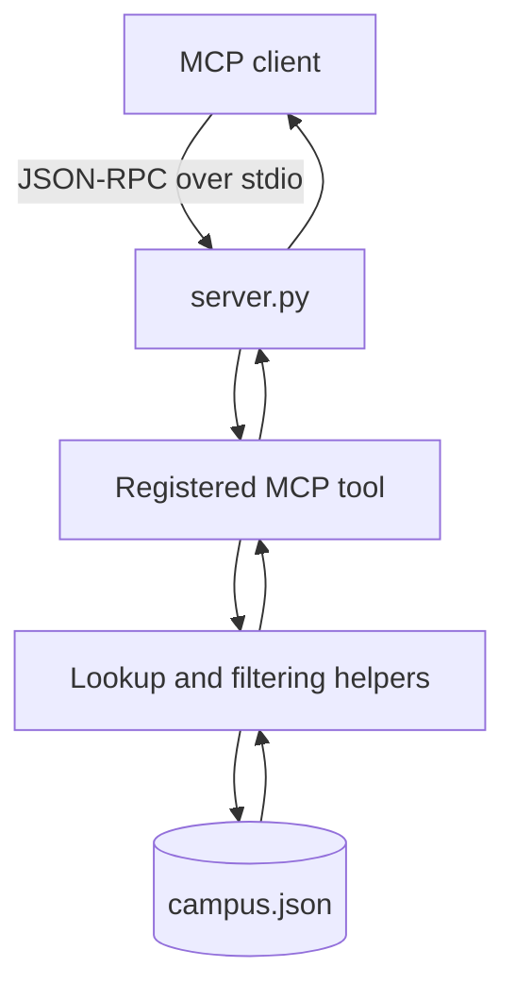

# TrojanGuide MCP

TrojanGuide is a local [Model Context Protocol](https://modelcontextprotocol.io/) server that exposes structured tools for searching a small USC campus-information dataset.

An MCP-compatible client can use the server to look up buildings, libraries, dining locations, and student services instead of relying only on the language model’s stored knowledge.

> **Unofficial project:** TrojanGuide is an independent student project and is not affiliated with or maintained by the University of Southern California. Information in the local dataset may be incomplete or outdated. Confirm important details through official USC sources.

## Motivation

Language models may provide outdated or unsupported answers when asked about location-specific information. I built TrojanGuide to learn how MCP allows an application to expose structured functions and local data to an LLM client.

The project focuses on four ideas:

- Defining tools with typed inputs and clear descriptions.
- Separating tool logic from the language model.
- Loading and reusing a local data source efficiently.
- Returning inspectable search results to the client.

## Available Tools

| Tool | Purpose |
| --- | --- |
| `find_building` | Find an academic building or campus landmark by name |
| `find_library` | List libraries or filter them by an available feature |
| `find_food` | Search dining locations using a cuisine or keyword |
| `find_student_service` | Find student-support offices and services |
| `search_campus` | Search across every supported category |

Examples of supported questions include:

- “Where is Leavey Library?”
- “Which libraries have printing?”
- “Find dining locations related to coffee.”
- “Where can I find career services?”
- “Search the campus dataset for financial aid.”

The exact result depends on the 67 entries currently stored in `data/campus.json`.

## How It Works


```mermaid
flowchart TD
    A[MCP client] -->|JSON-RPC over stdio| B[server.py]
    B --> C[Registered MCP tool]
    C --> D[Lookup and filtering helpers]
    D --> E[(campus.json)]
    E --> D
    D --> C
    C --> B
    B --> A
```

Request lifecycle:

1. An MCP client launches `server.py` as a subprocess.
2. The client and server communicate over standard input and output.
3. The MCP SDK generates tool schemas from Python type hints and docstrings.
4. When a tool is called, the data loader reads `data/campus.json` on first use.
5. The parsed dataset is cached in memory for later calls.
6. Search helpers perform case-insensitive name, category, or keyword matching.
7. The selected tool formats the matching entries and returns them to the client.

The client decides when to call a tool and how to use the returned result in its response.

## Project Structure

```text
TrojanGuide-MCP/
├── server.py               # Registers tools and starts the stdio server
├── tools/
│   ├── building.py         # find_building
│   ├── library.py          # find_library
│   ├── food.py             # find_food
│   ├── services.py         # find_student_service
│   └── search.py           # search_campus
├── utils/
│   └── data_loader.py      # Dataset loading, caching, and search helpers
├── data/
│   └── campus.json         # Local campus-information dataset
├── requirements.txt
└── README.md
```

## Setup

Clone the repository:

```bash
git clone https://github.com/dhyanagni2001-commits/TrojanGuide-MCP.git
cd TrojanGuide-MCP
```

Create and activate a virtual environment:

```bash
python3 -m venv .venv
source .venv/bin/activate
```

On Windows PowerShell:

```powershell
py -m venv .venv
.venv\Scripts\Activate.ps1
```

Install the dependencies:

```bash
python -m pip install -r requirements.txt
```

## SDK Compatibility

The MCP Python SDK has separate v1 and v2 release lines with breaking API differences. Use the SDK version declared by this repository’s `requirements.txt`.

If the implementation imports the v1 `FastMCP` API, keep the dependency on the supported v1 line until the server has been migrated and tested:

```text
mcp[cli]>=1.28,<2
```

Do not remove the upper version bound without verifying the server against the v2 migration guide.

## Testing with MCP Inspector

Activate the virtual environment and start the development inspector:

```bash
mcp dev server.py
```

The command prints a local Inspector URL. Use the Inspector to:

- Confirm that all five tools are registered.
- Review the generated input schemas.
- Call tools with different queries.
- Inspect returned content and error behavior.

The `mcp dev` command requires the MCP CLI extra. If it is not included in `requirements.txt`, install the compatible CLI version for the SDK line used by the project.

## Running as a Stdio Server

```bash
python server.py
```

The process waits for protocol messages on standard input. It is not an interactive command-line application, so an idle terminal is expected when it is started without a connected client.

Avoid writing debugging messages to standard output because stdout carries MCP protocol messages. Use stderr or configured logging instead.

## Connecting an MCP Client

An stdio MCP client needs the absolute paths to the virtual-environment Python interpreter and `server.py`.

Example configuration for macOS or Linux:

```json
{
  "mcpServers": {
    "trojanguide": {
      "command": "/absolute/path/to/TrojanGuide-MCP/.venv/bin/python",
      "args": [
        "/absolute/path/to/TrojanGuide-MCP/server.py"
      ]
    }
  }
}
```

Example configuration for Windows:

```json
{
  "mcpServers": {
    "trojanguide": {
      "command": "C:\\absolute\\path\\to\\TrojanGuide-MCP\\.venv\\Scripts\\python.exe",
      "args": [
        "C:\\absolute\\path\\to\\TrojanGuide-MCP\\server.py"
      ]
    }
  }
}
```

Replace the placeholders with paths from your machine, add the configuration to your MCP client, and restart the client.

Client configuration locations and supported transports vary by application. Consult the documentation for the client you are using.

## Data Scope

`data/campus.json` contains 67 locally maintained entries covering:

- Academic buildings and landmarks
- Libraries
- Dining locations
- Student services

The dataset is loaded once and cached for the lifetime of the server process.

This is a small demonstration dataset rather than a complete campus directory. It does not automatically synchronize with official USC websites, operating hours, closures, menus, or service announcements.

## Search Behavior

The current search implementation uses straightforward case-insensitive and substring matching.

Advantages:

- No external database or API is required.
- Results are deterministic and easy to inspect.
- The implementation remains small and understandable.

Tradeoffs:

- Misspellings may not match.
- Synonyms may require explicit keywords in the data.
- Ranking becomes less useful as the dataset grows.
- The local data can become stale without a maintenance process.

## Limitations

- The dataset contains only 67 entries.
- Search is based on keywords and substrings rather than semantic similarity.
- The server does not verify information against official sources at query time.
- Opening hours and service availability may change.
- There is no automated data-refresh pipeline.
- The current transport is intended for a local stdio client.
- The repository does not currently document automated unit or integration tests.

## Possible Improvements

- Add source URLs and `last_verified` dates to each dataset entry.
- Add unit tests for every tool and data-loading error case.
- Add typo tolerance, normalized aliases, and result ranking.
- Add MCP resources for directly reading campus entries.
- Support Streamable HTTP for remote deployments that require it.
- Add schema validation for `campus.json`.
- Add continuous integration for formatting and tests.
- Remove generated files such as `__pycache__` from version control.
- Build a documented process for reviewing and refreshing the dataset.

## What I Learned

This project helped me understand how an MCP server exposes typed tools to an LLM application, how stdio transport differs from a normal web API, and how local data can be loaded once and reused across tool calls.

It also demonstrated an important limitation of tool grounding: connecting a model to a dataset makes answers traceable to that dataset, but it does not guarantee that the dataset itself is complete or current.
